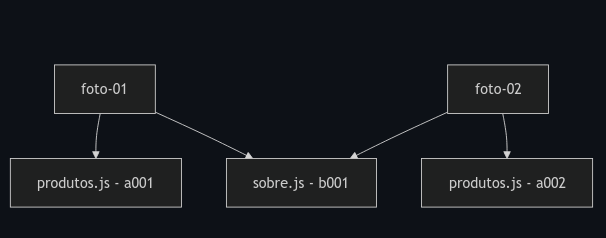

# Dia 5 - Controle de Versionamento

## Versionamento de código: uma timeline rápida

1.Bell Labs (1972) - SCCS (Source Code Control System) Centralizado
2.University of California, Berkeley (1982) - RCS (Revision Control System) Centralizado
3.CVS Team (1986) - CVS (Concurrent Versioning System) Centralizado
4.Apache Software Foundation (2000) - SVN (Subversion) Centralizado
5.Linus Torvalds (2005) - Git Distribuído

## Centralizado x Distribuído

- Centralizado

Nos sistemas centralizados existe uma cópia principal do código em um servidor e os desenvolvedores reservam arquivos para dentro de seu computador, ficando indisponíveis para os outros colaboradores. Importante: os arquivos reservados ainda são visíveis para todos os outros desenvolvedores, mas não podem ser alterados (estão em readonly).

Analogia: é como se um repositório fosse um "hotel" e os arquivos saíssem dele, fazendo um checkout (termo realmente usado nesse tipo de versionamento). De forma semelhante, quando os desenvolvedores não precisam mais do arquivo, eles fazem o checkin dele para o hotel, se tornando disponíveis para os outros desenvolvedores.

O motivo para que os sistemas centralizados serem bloqueantes é evitar ao máximo a dor de cabeça de os desenvolvedores terem que fazer merges (ou mesclas). Um merge ocorre quando mais de um desenvolvedor alterou um mesmo arquivo e, portanto, na hora de atualizar a base de código oficial, devem escolher que alterações manter e que alterações descartar, podendo ser uma terceira versão diferente da versão do desenvolvedor 1 e do desenvolvedor 2.

- Distribuído

Permitem que os desenvolvedores alterem qualquer arquivo, independente se há ou não outras pessoas mexendo naquele mesmo arquivo.

No momento de atualizar a base de dados oficial temos que fazer o merge de todas alterações. Quando há erros no processo de merge automático, temos um merge conflict que deve ser resolvido manualmente.

Nesse tipo de sistema, cada desenvolvedor pode fazer o clone de um repositório, tendo uma cópia exata e completa do código disponível para ele.

## Como funciona o Git por trás dos panos

Todas as informações de um repositório Git ficam guardadas localmente em um repositório .git.

## Comparando duas imagens

Quando queremos comparar a versão atual do código com outra versão anterior, estamos vendo suas `diffs`, daí vem o comando `git diff`, que mostra as diferenças entre arquivos, em relação ao staging area.

O Git tira sempre uma foto do seu projeto, pegando todos os arquivos dentro dele e adicionando um ID (identificador) neles e salvando dentro do repositório .git.

Onde cada conjunto arquivo+ID representa um `blob` (Binary Large Object). Note que quando alteramos um arquivo e criamos uma nova versão dele, o Git não descarta o primeiro `blob`, ele mantém este primeiro de forma imutável e cria um novo `blob` para a nova versão do arquivo.

Mas é importante ressaltar que, se um arquivo não foi alterado, o Git não cria um novo `blob` para ele, então a nova foto do projeto terá o mesmo `blob` do arquivo que não foi alterado.

Assim, no exemplo acima, a foto 02 terá o `blob` a002 para o arquivo produtos.js e o `blob` b001 para o arquivo sobre.js, supondo que o arquivo sobre.js não foi alterado.

Na verdade, o Git armazena fotos, que apontam para uma árvore, que por sua vez aponta para os blobs, com um mecanismo que compacta esses arquivos.

Mesmo que o Git não armazene diretamente os diffs, ele armazena os blobs e as árvores que contêm os blobs, portanto, é possível ver os diffs entre commits.

## Os 3 Estágios de um arquivo

| Nome      | Significado                                                                                                           |
| --------- | --------------------------------------------------------------------------------------------------------------------- |
| Modified  | Indica que o arquivo foi modificado, mas ainda não foi adicionado ao staging area                                     |
| Staged    | Indica que o arquivo foi adicionado ao staging area, são os arquivos a serem considerados quando vamos fazer o commit |
| Committed | Os arquivos que já foram adicionados ao staging area e que foram feitos o commit                                      |

## O que é a staging area?

A `staging area` é uma área que o Git usa para armazenar os arquivos que serão adicionados ao próximo `commit`. Ou seja, seguindo a nossa analogia, é como se o Git adicionasse esses arquivos à foto que ele vai tirar, como se estivessem subindo num palco, ou melhor, num "stage".

## Como vemos os arquivos de cada estágio?

Podemos ver os arquivos de cada estágio usando o comando `git status`. Usando esse comando, o Git compara tudo que tem de diferente no nosso diretório, desde o último commit.

Os arquivos que não estão em nenhum dos 3 estágios listados acima (modified, staged, commited) ainda podem estar em um quarto estágio: `Untracked`. Esses são os arquivos que estão no nosso diretório (pasta), mas que não estão sendo acompanhados pelo Git. Para nosso repositório Git, é como se estes arquivos não existissem.

## Mantendo arquivos invisíveis para o Git

Alguns tipos de arquivos não devem ser acompanhados pelo Git, como arquivos de configuração, arquivos de logs, arquivos de dependências (no nosso caso, a pasta `node_modules` e `.next`), entre outros. Para isso, usamos o arquivo .gitignore.

Para ignorarmos uma pasta ou um arquivo no .gitignore, basta adicionarmos o nome da pasta ou do arquivo no arquivo .gitignore.

## Alguns comando git

| Comando                   | Descrição                                                       |
| ------------------------- | --------------------------------------------------------------- |
| git log                   | lista os commits do repositório                                 |
| git add                   | adiciona arquivos ao staging area                               |
| git commit                | cria um commit                                                  |
| git commit --amend        | altera o último commit                                          |
| git diff                  | mostra as diferenças entre arquivos, em relação ao staging area |
| git diff --cached (BONUS) | mostra as diferenças entre arquivos, em relação ao commit       |
| git status (BONUS)        | mostra o status dos arquivos                                    |
